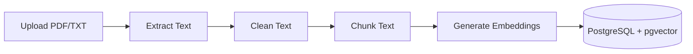
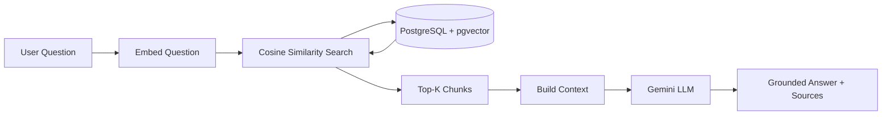

# Enterprise RAG Document Intelligence — Phase 1

A Retrieval-Augmented Generation (RAG) system that lets users upload company documents (PDF/TXT), ask natural-language questions about them, and receive answers grounded strictly in the retrieved document content — with source attribution for every answer.

This is Phase 1 of a larger Enterprise AI Document Intelligence Platform, built incrementally to learn production RAG architecture and the technologies commonly used in enterprise AI engineering roles.

## Problem Statement

Generic LLMs answer from general training knowledge, which makes them unreliable for company-specific questions (HR policy, internal FAQs, product documentation) — they can't know internal documents, and worse, they'll often hallucinate a plausible-sounding but wrong answer rather than admitting they don't know. This system solves that by retrieving the actual relevant passages from uploaded documents and constraining the LLM to answer only from that retrieved context, explicitly refusing to answer when the information isn't present.

## Architecture

**Ingestion pipeline:**


**Question-answering pipeline:**


## Technology Stack

| Component | Choice | Why |
|---|---|---|
| API framework | FastAPI (async) | Native async support for I/O-bound embedding/LLM calls |
| Database | PostgreSQL + pgvector | Combines relational metadata and vector similarity search in one system |
| ORM | SQLAlchemy 2.0 (async) | Type-safe, async-native database access |
| Embeddings & LLM | Google Gemini API (`gemini-embedding-001`, `gemini-3.6-flash`) | Free-tier accessible; cloud LLM API integration pattern |
| PDF parsing | PyMuPDF | Fast, reliable text extraction |
| Validation | Pydantic v2 | Request/response schemas, environment config validation |
| Containerization | Docker Compose | Reproducible local Postgres+pgvector environment |
| Testing | pytest, pytest-asyncio, httpx | Async-compatible test suite with mocked external APIs |

## Installation

**Prerequisites:** Python 3.11+, Docker Desktop, a free [Google AI Studio](https://aistudio.google.com) API key.

```bash
git clone https://github.com/ram-gaerlan/EnterpriseAI.git
cd EnterpriseAI/rag-system

python -m venv venv
venv\Scripts\Activate.ps1        # Windows
# source venv/bin/activate       # macOS/Linux

pip install -r requirements.txt

cp .env.example .env
# Edit .env and add your GEMINI_API_KEY

docker compose up -d
docker exec -it rag_postgres psql -U raguser -d ragdb -c "CREATE EXTENSION IF NOT EXISTS vector;"
python -m app.init_db

uvicorn app.main:app --reload
```

Visit `http://localhost:8000/docs` for the interactive Swagger UI.

## Environment Variables

| Variable | Description |
|---|---|
| `DATABASE_URL` | Async SQLAlchemy connection string for the main database |
| `TEST_DATABASE_URL` | Separate database used only by the test suite |
| `GEMINI_API_KEY` | Google AI Studio API key (embeddings + generation) |
| `UPLOAD_MAX_SIZE_MB` | Maximum accepted upload size (default: 10) |
| `ALLOWED_FILE_TYPES` | Comma-separated accepted extensions (default: `pdf,txt`) |

## How RAG Works Here

1. On upload, a document is split into overlapping, paragraph-aware chunks (not naive fixed-size slices), so ideas aren't cut mid-sentence.
2. Each chunk is embedded via Gemini (`task_type=RETRIEVAL_DOCUMENT`) and stored alongside its text in pgvector.
3. On a question, the question itself is embedded (`task_type=RETRIEVAL_QUERY` — an asymmetric embedding optimized for matching against document-style text).
4. pgvector's cosine distance operator (`<=>`) ranks all stored chunks against the question embedding directly in SQL; the top 5 are retrieved.
5. Retrieved chunks are labeled with their source document/chunk index and assembled into a single context block.
6. The LLM is instructed, via a system prompt, to answer **only** from that context and explicitly say when the answer isn't present — this is what prevents hallucination.

## API Endpoints

| Method | Path | Description |
|---|---|---|
| `POST` | `/documents/upload` | Upload a PDF/TXT file; extracts, chunks, embeds, and stores it |
| `POST` | `/questions/ask` | Ask a question; returns a grounded answer with sources |
| `GET` | `/health` | Basic liveness check |

## Example Usage

```bash
curl -X POST http://localhost:8000/documents/upload \
  -F "file=@test_policy.txt"
```

```bash
curl -X POST http://localhost:8000/questions/ask \
  -H "Content-Type: application/json" \
  -d '{"question": "How many vacation days do employees get?"}'
```

Response:
```json
{
  "answer": "Full-time employees are entitled to 15 days of paid vacation leave per calendar year, accrued monthly.",
  "sources": [
    {"document": "test_policy.txt", "chunk": 0, "similarity": 0.742}
  ]
}
```

## Example Questions

- "How many vacation days do employees get?"
- "What's included in the free tier?"
- "What is the capital of France?" *(demonstrates refusal — out of scope of uploaded documents)*

## Known Limitations

- No authentication or access control — anyone with API access can upload/query
- Original uploaded files are not retained; only extracted/chunked text is stored
- Chunking is character-based, not token-based — chunk sizes are approximate relative to LLM token limits
- Embedding generation is synchronous and blocks the upload request; large documents mean slow uploads
- Single embedding/LLM provider (Gemini) — no fallback if the API is unavailable
- No conversation memory — each question is answered independently, with no multi-turn context
- No endpoint to list, view, or delete previously uploaded documents

## Future Improvements (Phase 2+)

- Authentication and role-based access control
- Cloud deployment (Azure/AWS) with managed Postgres
- Background job queue for embedding generation (avoid blocking uploads)
- Object storage (S3/Azure Blob) for original files, with versioning
- Token-based chunking via `tiktoken`
- Streaming LLM responses
- Multi-turn conversational memory
- Evaluation framework for retrieval/answer quality
- Document management endpoints (list, view, delete)